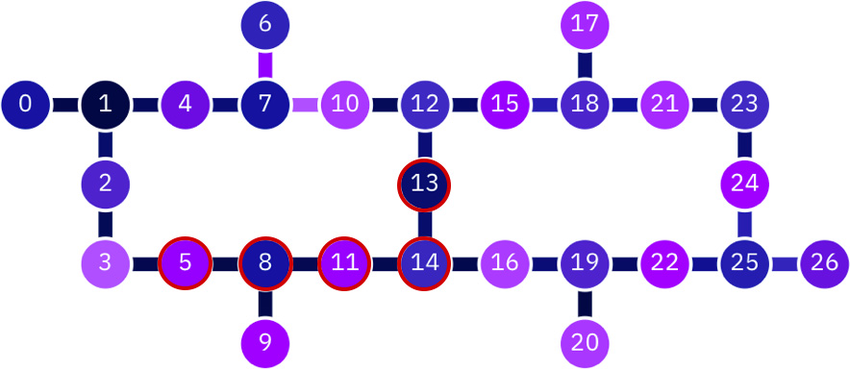

# Submission code for the ACM/IEEE Quantum Computing for Drug Discovery Challenge at ICCAD 2023

Structure model:

## Files

- `haml2tc.py` for constructing and saving Hamiltonian in sparse matrix format.
- `shvqe.py` for running SHVQE algorithm with the depth of cz gates as the input argument.

## Tasks

### SHVQE

- [x] Implement SHVQE.
- [ ] More seeds for initializing parameters.
- [ ] Add process bar.
- [ ] Improve training settings.

Results:

| depth | energy     | error | duration |
| ----- | ------     | ----- | -------- |
| 3     | -78.70827  | 5.95  | 7872     |
| 8     | -78.72387  | 3.85  | 19392    |
| 10    | -78.730896 | 2.91  | 24160    |
